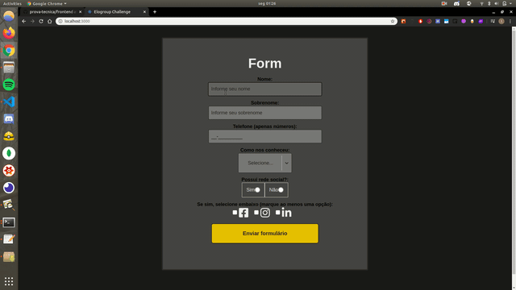

---
Prova Técnica para Desenvolvedor - EloGroup
---

---
Acesse a aplicação (forma estática)
---
Para acessar a aplicação, clique [aqui](https://pselogroup2020-italomarcos.netlify.com/). A aplicação segue os requisitos da documentação. O telefone aceita apenas números, caso o usuário **não** tenha redes sociais não é permitido marcar as opções, e nenhum campo pode ser deixado **em branco**.  **Toasts** foram implementados para alertar o usuário, além de ser permitido preencher a aplicação apenas **uma** vez, havendo um redirecionamento automático caso o mesmo tente acessar o formulário novamente.

Porém, essa aplicaão é **estática**. Então tomei a liberdade de construir uma API em **Node.js** para armazenar os dados (respostas do formulário), incluindo uma página **Dashboard** com acesso de Administrador para listar esses dados, siga as instruções abaixo para usar a aplicação.

---
Acesse a aplicação (com uma API rodando)
---
O projeto está dividido em duas partes, o **backend** e o **frontend**, nas suas respectivas pastas.

---
Pré-requisitos
---

- [Node.js](https://nodejs.org/en/download/) instalado.
- [Docker](https://docs.docker.com/install/) e [Docker-cli](https://docs.docker.com/install/linux/docker-ce/ubuntu/#install-docker-engine---community-1). O Docker-cli permite usar comandos do terminal para executar o Docker.

---
Demonstração do formulário sendo preenchido
---



Para ver em uma resolução melhor, clique [aqui](https://youtu.be/G8qENH0U4hs). (vídeo de 29seg)

---
Executando o servidor
---

Abra um terminal e execute os seguintes comandos da maneira como foram definidos, não altere nada.

- Clone o repositório:
```
git clone https://github.com/italomarcos1/prova-tecnica.git
```
- Crie um container do Docker com uma imagem do Postgres para armazenar os dados respondidos no formulário: 
```
sudo docker run --name=provatecnica -e POSTGRES_PASSWORD=challenge -e POSTGRES_USER=elogroup-t -d -p 5432:5432 postgres:11
```
- Inicie o container criado acima:
```
docker start provatecnica
```
- Entre na pasta que contém os arquivos do servidor:
```
cd prova-tecnica/backend
```
- Rode o comando abaixo para instalar as dependências e popular o banco (**seeds**) com os dados do Administrador e alguns dados de usuários:
```
npm install && npm run touch
```
- Por fim, execute a aplicação com o script abaixo:

```
npm run dev
```

Após isso o servidor estará executando. Deixe este terminal rodando em segundo-plano e deve abrir um outro terminal para executar o front-end.

---
Executando a aplicação
---

- Abra um novo terminal na raiz do projeto, acesse a pasta da aplicação com:
```
cd frontend
```
- Rode o comando abaixo para instalar as dependências:
```
npm install
```
- Por fim, execute a aplicação com o script abaixo:

```
npm run start
```

---
Plataforma Gupy
---
Italo Marcos

---
LinkedIn
---
[Italo Marcos](https://www.linkedin.com/in/italomarcos1)
